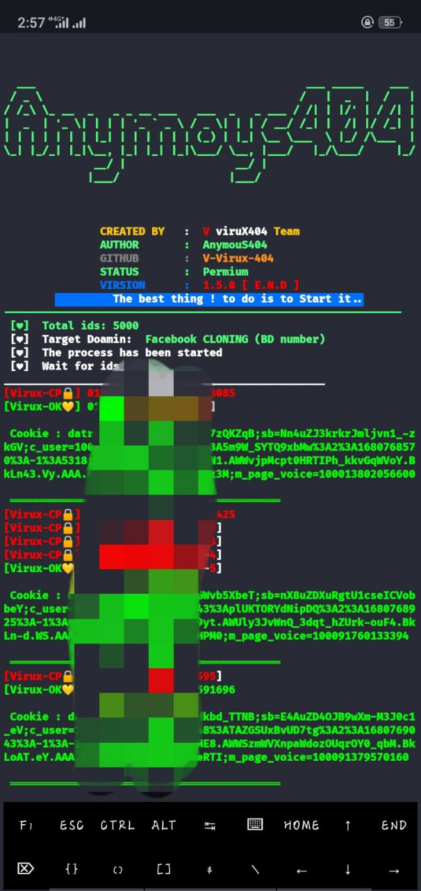

# Another Random Cloning Tools 🔥

# Install Methods..

      pkg update && upgrade

          pkg install git
 
    pkg install python && python2

        pkg install git

      pip install requests

      pip install mechanize
git clone https://github.com/V-Virux-404/Anymous-404

          cd Anymous-404

       python anymous-404.py

# Okz Idzz prOoF 🔥

